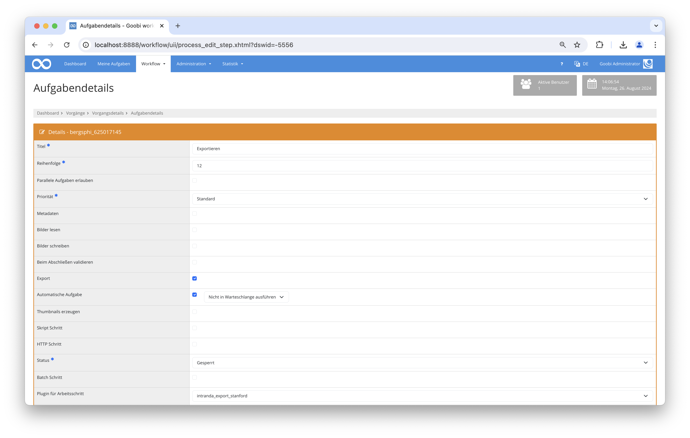

## Einführung
Die vorliegende Dokumentation beschreibt die Installation, die Konfiguration und den Einsatz des Stanford Export Plugins in Goobi workflow.

## Installation
Um das Plugin nutzen zu können, müssen folgende Dateien installiert werden:

```xml
/opt/digiverso/goobi/plugins/export/plugin_intranda_export_stanford.jar
```

Daneben gibt es eine Konfigurationsdatei, die an folgender Stelle liegen muss:

```xml
/opt/digiverso/goobi/config/plugin_intranda_export_stanford.xml
```

Für die Verwendung des Plugins muss dieses in einem Arbeitsschritt ausgewählt sein:




## Überblick und Funktionsweise
Es muss ein Export Schritt konfiguriert werden:

* Export DMS
* Automatische Aufgabe
* Plugin für Arbeitsschritt: intranda_export_stanford

Bei der Ausführung des Schrittes wird ein Export des Goobi Vorgangs (analog zum Export ins Dateisystem) in das konfigurierte Verzeichnis durchgeführt.

Dabei werden innerhalb des Ordners Unterordner basierend auf dem Identifier erzeugt. Der Identifier `qx797sg1405` würde dabei folgende Struktur generieren: `/path/to/folder/qx/797/sg/1405`. Innerhalb dieses Ordners werden zwei weitere Ordner erstellt, `metadata` und `content`.

In `content` werden alle erzeugten images, und sofern vorhanden die ALTO Dateien und Einzelseiten PDFs geschrieben. Außerdem wird aus den Einzelseiten eine komplette PDF Datei erzeugt. Der Ordner `metadata` enthält eine XML Datei mit den Angaben zu den Dateien innerhalb des content Ordners

Anschließend wird die konfigurierte URL zur Rest API aufgerufen, um den ingest in das System zu starten.

## Konfiguration
Die Konfiguration des Plugins erfolgt in der Datei `plugin_intranda_export_stanford.xml` wie hier aufgezeigt:

{{CONFIG_CONTENT}}

Die folgende Tabelle enthält eine Zusammenstellung der Parameter und ihrer Beschreibungen:

Parameter               | Erläuterung
------------------------|------------------------------------
|  `tempDestination` | Wenn das Element vorhanden und nicht leer ist, werden die Metadaten in diesen Ordner als 'dor_export_{objectId}.xml geschrieben |
| `destination` | Root Verzeichnis für die exportierten Daten |
| `metadataFileName` | Name der Metadaten Datei, enthält Einträge zu jeder exportierten Datei |
| `dela` | Wenn das Element vorhanden ist und eine Zahl größer 0 enthält, wird nach dem erfolgreichen Export die konfigurierte Anzahl an Sekunden gewartet, bevor die Rest API aufgerufen wird |
| `apiBaseUrl` | Basis URL zur Rest API |
| `endpoint` | Endpoint zur Rest API |
| `accessToken` | enthält den token, der für die Authentifizierung der Rest API benötigt wird |
| `queryParameter` | Enthält in den Attributen `name` und `value` einen query Parameter, der zusätzlich als `&name=value` an die URL angehängt wird. Das Feld ist wiederholbar. |
